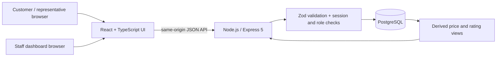
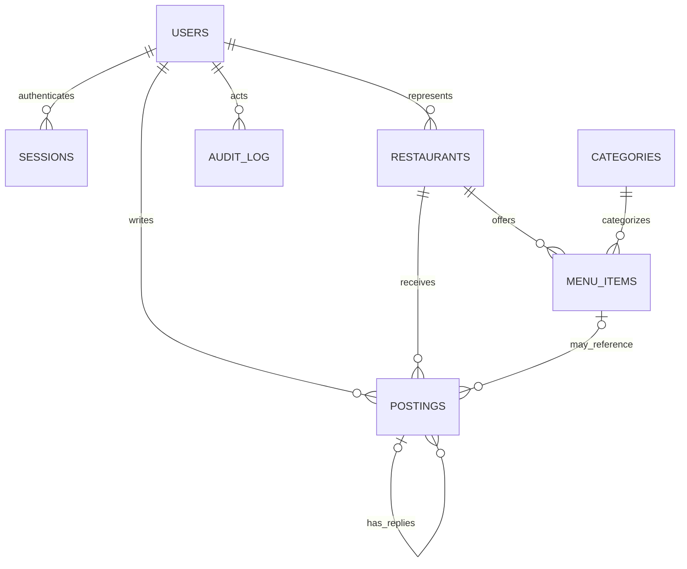
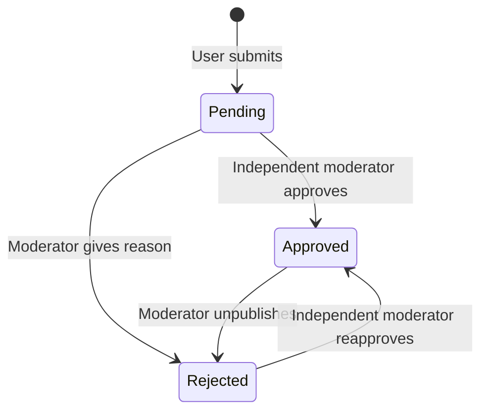

# Architecture and data design

## Application structure

During development Vite proxies `/api` to Express. In a built local run, Express serves Vite's static output and the same API. All authoritative application data lives in PostgreSQL, not browser storage. The browser holds only UI state and an HttpOnly session cookie.

## Relational model

| Table               | Significant columns / rules                                                                                                                                |
| ------------------- | ---------------------------------------------------------------------------------------------------------------------------------------------------------- |
| `users`             | Name, unique normalized email, bcrypt password hash, constrained role.                                                                                     |
| `sessions`          | SHA-256 hash of a random token, user FK, expiry timestamp.                                                                                                 |
| `categories`        | Unique display name and URL slug.                                                                                                                          |
| `restaurants`       | Name, constrained city, address, description, image URL, optional owner FK.                                                                                |
| `menu_items`        | Restaurant/category FKs, multilingual names, description, exact decimal price, image URL, boolean dietary fields, spice integer. Vegan implies vegetarian. |
| `postings`          | Author, restaurant, optional dish, optional parent review, kind, text, four ratings for reviews, publication status, moderation metadata.                  |
| `audit_log`         | Staff actor, action/entity, timestamp, JSON detail; updates and audit writes share a transaction.                                                          |
| `schema_migrations` | Applied migration version and timestamp.                                                                                                                   |

A partial unique index on `(author_id, restaurant_id, menu_item_id)` with `NULLS NOT DISTINCT` gives each author one review per dish plus one for the restaurant as a whole, so a single account cannot move a rating by repetition. Rejected reviews are excluded from the index, leaving the subject free for a rewrite. The composite FK `(menu_item_id, restaurant_id)` prevents associating a review with another restaurant's dish. A check constraint distinguishes rated root reviews from unrated comments/responses. The API validates that reply parents are approved root reviews in the correct restaurant. Menu moves between restaurants are disallowed to preserve review meaning.

`restaurant_stats` and `menu_stats` are ordinary SQL views, not materialized caches. Correlated aggregates avoid inflating menu/review counts through joins. Only approved root reviews enter rating aggregates. Price averages use all current menu items, including unrated dishes. Restaurant categories are projected from their menu entries.

## API routes

| Method / route                   | Permission                        | Purpose                                                     |
| -------------------------------- | --------------------------------- | ----------------------------------------------------------- |
| `GET /api/health`                | Public                            | PostgreSQL connectivity check                               |
| `GET /api/config`                | Public                            | Configured portal name                                      |
| `GET /api/categories`            | Public                            | Taxonomy                                                    |
| `GET /api/explore`               | Public                            | Restaurants and dishes; search/filter/sort query parameters |
| `GET /api/restaurants/:id`       | Public                            | Restaurant, menu, approved conversation, rating breakdown   |
| `POST /api/auth/register`        | Public                            | Create customer account and session                         |
| `POST /api/auth/login`           | Public                            | Verify password and establish session                       |
| `GET /api/auth/me`               | Public                            | Current safe user profile or null                           |
| `POST /api/auth/logout`          | Session                           | Invalidate server session and cookie                        |
| `POST /api/reviews`              | Signed in                         | Queue rated review, with optional dish                      |
| `POST /api/reviews/:id/replies`  | Signed in; ownership for response | Queue comment or company response                           |
| `GET /api/my-postings`           | Signed in                         | Author's private statuses/rejection notes                   |
| `GET /api/admin/data`            | Moderator/admin                   | Catalog and moderation queue                                |
| `POST /api/admin/restaurants`    | Admin                             | Create restaurant                                           |
| `PUT /api/admin/restaurants/:id` | Admin                             | Update restaurant and owner assignment                      |
| `POST /api/admin/menu`           | Admin                             | Create menu item                                            |
| `PUT /api/admin/menu/:id`        | Admin                             | Update menu, exact price, attributes, names, image          |
| `PATCH /api/admin/postings/:id`  | Moderator/admin; not author       | Approve/reject/unpublish with audit record                  |

Explore parameters: `q`, `city`, `category` (slug), `vegetarian=true`, `vegan=true`, `halal=true`, `spice=0..3`, `band=budget|mid|premium`, `sort=recommended|rating|price-low|price-high|name`. When several dietary/category constraints are provided, a single menu row must satisfy all of them.

All unsafe API methods require `X-Requested-With: CeylonEats`. When a browser sends `Origin`, it must exactly match `APP_ORIGIN`. There is no permissive CORS policy. JSON payloads are limited to 32KB. Unknown fields are stripped by validation; user-supplied roles/status/rank values do not become database writes.

## Publication lifecycle

The UI never optimistically publishes user content. It shows a pending acknowledgement and directs authors to their contributions. Public queries filter status in SQL; hiding pending posts does not depend on the client.

## Operational notes

Migrations are the `.sql` files in `server/migrations/`, applied in filename order; each runs once, inside one transaction, behind an advisory lock, with its version recorded. Seed operations also run in a transaction and skip existing data. Staff writes record their audit event within the same transaction. Prices use database decimal arithmetic; JSON returns decimals as strings to avoid implicit driver rounding.

The development server, bundled database and secrets are local. Deployment, persistent image upload storage, password recovery, real owner verification, paginated queries, central logging, external identity providers, spam scoring and database backups are future operational work, not simulated features.
